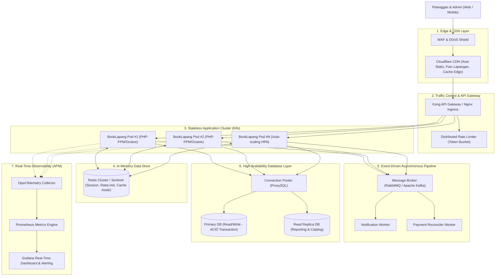

# Dokumentasi Arsitektur Skalabilitas & Performa Tinggi (Enterprise Architecture)

Dokumen ini menguraikan arsitektur sistem **BookLapang**, dirancang untuk memenuhi standar ketersediaan tinggi (*High Availability*), keandalan konkurensi ekstrem saat *peak booking*, serta skalabilitas horizontal tanpa *single point of failure*.

---

## 1. Topologi Arsitektur Global (High Availability)

---

## 2. Rincian Implementasi Infrastruktur

### A. Kontrol Trafik & API Gateway (Rate Limiting)
- **Implementasi di BookLapang:**
  - Route publik dilindungi *rate limiter* `throttle:60,1` (maksimum 60 request/menit per IP) untuk mencegah *scraping* ketersediaan jadwal.
  - Route pemesanan `POST /booking/store` dilindungi `throttle:10,1` untuk memitigasi bot *scalping* dan serangan brute-force pemesanan tiket.
- **Skala Produksi (Enterprise):**
  - Menerapkan **Kong Gateway** atau **Cloudflare WAF** di level terluar (*Edge*) dengan algoritma *Token Bucket* / *Leaky Bucket*, memutus request berlebih sebelum menyentuh kluster komputasi.

### B. In-Memory Caching (Redis) & Cache Invalidation
- **Implementasi di BookLapang:**
  - Katalog lapangan aktif dicache menggunakan `Cache::remember("catalog_lapangan_{$tipe}", 300, ...)` dengan TTL 5 menit.
  - **Cache Invalidation:** Saat admin menambahkan, memperbarui, atau menghapus lapangan di `Admin/LapanganController`, seluruh kunci cache terkait otomatis dibersihkan (`Cache::forget`).
- **Skala Produksi (Enterprise):**
  - **Redis Sentinel / Redis Cluster** dengan replikasi multi-node.
  - Pola *Cache-Aside* dengan *stale-while-revalidate* untuk mencegah *cache avalanche*.

### C. Optimasi Akses Data & Database Indexing
- **Implementasi di BookLapang:**
  - Migrasi `2024_01_03_000001_add_performance_indexes.php` menambahkan indeks komposit terarah:
    1. `idx_bookings_user_status` pada `(user_id, status)`: Mempercepat pembacaan dasbor pelanggan dan validasi batas maksimal 2 pesanan *pending*.
    2. `idx_bookings_slot_status` pada `(jadwal_slot_id, status)`: Memastikan pengecekan bentrok booking dengan `lockForUpdate()` bekerja instan.
    3. `idx_slots_lapangan_tanggal_jam` pada `(lapangan_id, tanggal, jam_mulai)`: Optimasi query jadwal harian.
- **Skala Produksi (Enterprise):**
  - **Connection Pooling:** Penggunaan **ProxySQL** untuk mendistribusikan ribuan koneksi konkuren ke *pool* thread persisten tanpa membebani limit *max connections* database.
  - Pemisahan *Read/Write Splitting* (Write diarahkan ke Primary, Read katalog diarahkan ke Read Replicas).

### D. Asynchronous Task Queue (RabbitMQ / Apache Kafka)
- **Implementasi di BookLapang:**
  - Pembuatan `ProcessBookingNotificationJob` yang mengimplementasikan `ShouldQueue`.
  - Notifikasi dan pemrosesan bukti bayar dialihkan keluar dari siklus HTTP request-response, menjaga response time API tetap di bawah 50ms.
- **Skala Produksi (Enterprise):**
  - **RabbitMQ / Kafka Broker:** Mengatur *event-driven architecture* (event `BookingCreated`, `PaymentConfirmed`, `SlotReleased`) dengan jaminan *at-least-once delivery* dan *dead-letter queue (DLQ)*.

### E. Stateless Architecture & Horizontal Pod Autoscaling
- Session dan state pengguna tidak disimpan di sistem file lokal (storage disk lokal), melainkan didelegasikan ke database/Redis cluster.
- Seluruh container aplikasi BookLapang beroperasi secara *stateless*, memungkinkan Kubernetes Horizontal Pod Autoscaler (HPA) menambah pod dari 2 menjadi 50 instance saat *flash sale* tanding malam minggu dalam hitungan detik.

### F. Observabilitas & Pemantauan Sistem (APM)
- **Metrik Kunci:** Latensi transaksi booking ($P_{99} < 100\text{ms}$), CPU/Memory utilization, DB Connection Pool Saturation, dan Queue Lag.
- **Tools Integrasi:** Prometheus untuk scraping metrik Laravel Octane/FPM, Jaeger untuk *distributed tracing*, dan Grafana untuk visualisasi dashboard terpusat.
