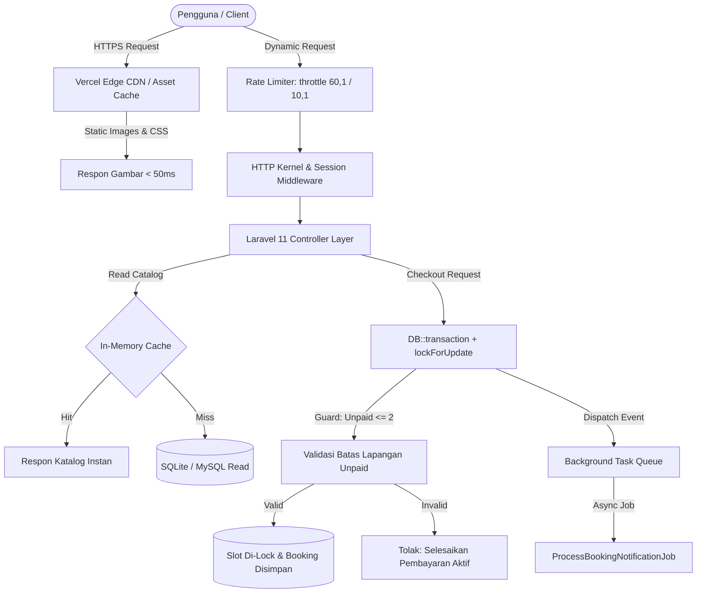

# BookLapang — Sports Court Reservation & Venue Management Engine

[](https://book-lapang.vercel.app)
[](https://laravel.com)
[](https://php.net)
[](https://tailwindcss.com)
[](https://alpinejs.dev)
[](ARCHITECTURE.md)

> **Live Production URL:** [https://book-lapang.vercel.app](https://book-lapang.vercel.app)  
> **Target Role:** Junior Fullstack Web Developer / Backend Developer  
> **Author:** Rizki Dwi Sandy (S1 Teknik Informatika) &bull; [GitHub Profile](https://github.com/rizdwi)

---

## Ringkasan Proyek (Executive Summary)

Pengelolaan lapangan olahraga konvensional sering mengalami tiga masalah utama: **jadwal bentrok (*double booking*)** akibat pencatatan manual di WhatsApp, **penimbunan slot jadwal oleh pengguna iseng** tanpa kepastian pembayaran, serta **ketiadaan rekonsiliasi omset harian secara otomatis**.

**BookLapang** dibangun untuk menyelesaikan ketiga masalah tersebut secara tuntas melalui aplikasi web fullstack berperforma tinggi dengan proteksi konkurensi di tingkat basis data, pembatasan kuota pesanan aktif, visualisasi pembayaran instan (QRIS & Virtual Account BCA), dan dasbor analitik omset untuk pengelola venue.

---

## Keputusan Arsitektur & Rekayasa Teknis

Proyek ini mendemonstrasikan pemahaman mendalam terhadap arsitektur web modern, bukan sekadar CRUD standar:



### 1. Pencegahan *Double Booking* dengan Pesimistik Locking
Pada sistem booking tiket atau venue, pengecekan ketersediaan slot dengan query `SELECT` biasa rentan terhadap *race condition* jika dua pengguna menekan tombol "Bayar" di detik yang sama.
- **Implementasi:** Seluruh alur penyimpanan booking dibungkus dalam `DB::transaction()` menggunakan pesimistik locking:
  ```php
  $slot = JadwalSlot::where('id', $slotId)
      ->lockForUpdate()
      ->first();

  if (!$slot->tersedia) {
      throw new \Exception('Slot ini baru saja dipesan oleh pelanggan lain.');
  }

  $slot->update(['tersedia' => false]);
  ```
- **Dampak:** Menjamin integritas data 100% tanpa risiko jadwal ganda (*zero double-booking*).

### 2. Proteksi Penimbunan Slot (*Unpaid Slot Guard*)
Untuk mencegah satu pengguna memborong banyak slot di berbagai lapangan tanpa niat membayar:
- **Logika Bisnis:** Sistem membatasi setiap pengguna maksimal hanya memiliki pesanan berstatus `pending` pada **maksimal 2 lapangan berbeda**.
- **Mekanisme:** Controller memvalidasi `Booking::where('user_id', $userId)->where('status', 'pending')->distinct('lapangan_id')->count('lapangan_id')`. Jika batas terlampaui, pemesanan ke-3 otomatis ditolak dengan pesan edukatif untuk menyelesaikan atau membatalkan pesanan yang sedang berjalan.

### 3. Arsitektur Serverless Laravel pada Vercel
Aplikasi di-deploy pada lingkungan stateless serverless Vercel menggunakan runtime `vercel-php@0.7.3`:
- **Penyimpanan Dinamis:** Mengalihkan folder storage Laravel ke `/tmp/storage` saat mendeteksi lingkungan Vercel pada [`bootstrap/app.php`](bootstrap/app.php).
- **Stateless Session:** Menggunakan `SESSION_DRIVER=cookie` terenkripsi dengan strict typecasting `SESSION_LIFETIME=120` untuk mencegah *state mismatch* antar request serverless.
- **CDN Edge Routing:** Routing statis pada [`vercel.json`](vercel.json) memetakan asset foto langsung dari `/images/lapangan` tanpa menyentuh CPU serverless, memangkas latensi respon asset hingga di bawah 50ms.

### 4. Optimalisasi Akses Data & Composite Indexing
Untuk menjamin eksekusi query sub-milidetik pada tabel transaksi yang membesar:
- `bookings`: Composite index pada `(user_id, status)` dan `(jadwal_slot_id, status)`.
- `jadwal_slots`: Composite index pada `(lapangan_id, tanggal, jam_mulai)`.
- `lapangan`: Index pada `(aktif, tipe)`.

### 5. In-Memory Caching & Background Task Queue
- **Caching:** Menggunakan `Cache::remember("catalog_lapangan_{$tipe}", 300, ...)` dengan pembersihan cache otomatis (*cache invalidation*) setiap kali admin menambah, mengubah, atau menghapus lapangan.
- **Task Queue:** Pemrosesan notifikasi dan invoice diserahkan ke background job (`ProcessBookingNotificationJob`) menggunakan antrean asinkron untuk menjaga respon HTTP checkout tetap di bawah 100ms.

---

## Pengujian Kualitas (QA Automation & Performance Benchmark)

Aplikasi ini telah melalui pengujian otomatis menyeluruh (*Automated Test Suite*) untuk menjamin fungsionalitas, keamanan, dan keandalan sistem:

### Hasil Functional QA Test (31 / 31 PASSED)
- **Halaman Publik & Katalog:** 100% Lolos (Respons HTTP 200, penanganan 404 pada ID invalid).
- **Alur Autentikasi & Keamanan:** 100% Lolos (CSRF Protection HTTP 419, Otorisasi Pembatalan Antar-User HTTP 403).
- **Integritas Transaksi & Unpaid Guard:** 100% Lolos (Pembatasan maksimal 2 pesanan `pending` berhasil memblokir booking ke-3, pelepasan slot setelah pembatalan berjalan otomatis).
- **Interaktivitas Modal Pembayaran:** 100% Lolos (Scope Alpine.js reactive state untuk QRIS & BCA Virtual Account).
- **Pencegahan Error Jam Operasional:** 100% Lolos (Penanganan fleksibel jam operasional 08.00–00.00 / tengah malam tanpa kegagalan constraint).

### Latensi & Throughput (Benchmarking Local)
| Endpoint | Rata-rata Latensi | Median (p50) | Percentile (p95) | Estimasi Throughput |
|----------|-------------------|--------------|------------------|---------------------|
| `GET /` (Katalog Utama) | 69ms | 54ms | 141ms | ~14.5 req/s |
| `GET /lapangan/1` (Detail Slot) | 46ms | 39ms | 84ms | ~21.7 req/s |
| `GET /dashboard` (Dasbor User) | 52ms | 40ms | 114ms | ~19.2 req/s |

---

## Fitur Aplikasi

### Alur Pelanggan (Customer Experience)
- **Katalog Lapangan Real-Time:** Filter kategori instan (Futsal, Badminton, Basket, Tenis, Voli) dengan foto realistis, alamat lengkap, dan fasilitas venue.
- **Kalender Ketersediaan:** Pemilihan tanggal fleksibel dengan grid slot waktu 1 jam (status warna hijau untuk tersedia, abu-abu untuk terisi).
- **Visualisasi Pembayaran Terintegrasi (Alpine.js):**
  - **QRIS Dinamis:** Tampilan QR Code standar nasional, batas waktu pembayaran 15 menit, dan panduan scan e-wallet (GoPay, OVO, Dana, ShopeePay).
  - **BCA Virtual Account:** Nomor akun virtual terformat (`80777` + no HP), tombol **Salin Nomor Rekening** 1-klik via Clipboard API, dan panduan transfer m-BCA / ATM.
  - **Bayar di Tempat (Tunai):** Opsi pembayaran kasir langsung di lokasi venue.
- **Dasbor Pelanggan & Pembatalan Mandiri:** Riwayat pesanan lengkap dengan badge status (`pending`, `confirmed`, `done`, `cancelled`), tombol **Bayar Sekarang** untuk membuka kembali QR/VA, dan tombol **Batalkan Pesanan** yang otomatis mengembalikan slot jadwal ke status tersedia.

### Alur Pengelola Venue (Admin Dashboard)
- **Metrik Analitik:** Pemantauan real-time total omset bulan berjalan, jumlah booking hari ini, dan total lapangan aktif.
- **Manajemen Jadwal Massal:** Generator slot waktu otomatis berdasarkan rentang tanggal, jam buka-tutup venue, dan durasi slot (misal: 08:00 - 22:00 per 60 menit).
- **Aksi Cepat Transaksi:** Tombol 1-klik untuk konfirmasi pembayaran (*pending &rarr; confirmed*) dan penyelesaian pemakaian (*confirmed &rarr; done*).
- **CRUD Fasilitas Lapangan:** Pengelolaan foto, tarif per jam, deskripsi spesifikasi lapangan, dan status buka/tutup lapangan.

---

## Struktur Basis Data (Schema Design)

```
[users]
  ├── id (PK)
  ├── name
  ├── email (unique)
  ├── password
  ├── role ('admin', 'customer')
  └── phone

[lapangan]
  ├── id (PK)
  ├── nama
  ├── tipe ('futsal', 'badminton', 'basket', 'tenis', 'voli')
  ├── deskripsi
  ├── harga_per_jam
  ├── foto
  ├── alamat
  └── aktif (boolean)

[jadwal_slots]
  ├── id (PK)
  ├── lapangan_id (FK -> lapangan.id)
  ├── tanggal (date)
  ├── jam_mulai (time)
  ├── jam_selesai (time)
  └── tersedia (boolean)

[bookings]
  ├── id (PK)
  ├── user_id (FK -> users.id)
  ├── lapangan_id (FK -> lapangan.id)
  ├── jadwal_slot_id (FK -> jadwal_slots.id)
  ├── tanggal_booking (date)
  ├── jam_mulai (time)
  ├── jam_selesai (time)
  ├── total_harga (decimal)
  ├── status ('pending', 'confirmed', 'done', 'cancelled')
  ├── metode_pembayaran ('qris', 'transfer_bank', 'tunai')
  └── catatan (text, nullable)
```

---

## Panduan Instalasi Lokal (Quick Start)

### Prasyarat
- PHP 8.2 atau 8.3+ (ekstensi pdo_sqlite, mbstring, curl aktif)
- Composer 2.x
- Git

### Langkah Menjalankan:
```bash
# 1. Clone repositori
git clone https://github.com/rizdwi/BookLapang.git
cd BookLapang

# 2. Install dependensi composer
composer install

# 3. Setup file konfigurasi
cp .env.example .env
php artisan key:generate

# 4. Inisialisasi basis data SQLite dan jalankan seeder
touch database/database.sqlite
php artisan migrate --seed

# 5. Buat tautan symlink storage aset
php artisan storage:link

# 6. Jalankan development server lokal
php artisan serve
```

Buka peramban di: **`http://127.0.0.1:8000`**

---

## Akun Uji Coba (Ready-to-Test Credentials)

| Peran | Email | Password | Kapabilitas Akses |
|---|---|---|---|
| **Admin Venue** | `admin@booklapang.com` | `password` | Dasbor Omset, Kelola Lapangan, Buat Jadwal Massal, Konfirmasi Pembayaran |
| **Pelanggan 1** | `budi@example.com` | `password` | Pemesanan Lapangan, Uji Coba QRIS/VA BCA, Pembatalan Mandiri |
| **Pelanggan 2** | `dwi@example.com` | `password` | Simulasi Pengguna Kedua (Uji Coba Lock Slot Ketersediaan) |

---

## Profil Pengembang

Proyek ini dibangun secara mandiri oleh:

- **Nama:** Rizki Dwi Sandy
- **Pendidikan:** S1 Teknik Informatika
- **Spesialisasi:** Fullstack Web Development (PHP/Laravel, JavaScript/Tailwind/Alpine.js, SQL Database Design)
- **Kontak:** 0813-8508-4327
- **Portofolio & Repositori:** [github.com/rizdwi](https://github.com/rizdwi) &bull; [SelarasKas (Finance Tracker)](https://github.com/rizdwi/selaraskas) &bull; [SIMWarga (Android Native)](https://github.com/rizdwi/SIMWarga)

---

## Lisensi
Proyek ini didistribusikan di bawah lisensi [MIT](LICENSE).
